# Plyo Schema Extender

A WordPress plugin for adding additional Schema to the 

[Yoast SEO plugin]: https://yoast.com/	"Yoast SEO Plugin"

.

Plyo Schema Extender (PLSE) provides interface for registering and managing some additional Schema defined on 

[Schema.org]: https://schema.org	"Schema.org"

 (Game, Service, Event), when the Yoast SEO plugin is already installed.

Official development of Plyo Schema Extender (PLSE) is on GitHub. The GitHub repo can be found at [https://github.com/pindiespace/plyo-schema-extender](https://github.com/pindiespace/plyo-schema-extender). 

This is a demo project, and does not provide any additional user support.

[TOC]

------


## **Contributors:**  

**Pete Markiewicz**

**Tags:** Schema, Schema.org, Custom Post Types, Yoast SEO, Yoast Local SEO

Requires at least: 1.0.0
Tested up to: 1.0.0
Stable tag: 1.0.0
License: GPL-2.0+
Requires PHP: 5.6
Requires **Yoast SEO 17.5+** to function.

## Screenshot

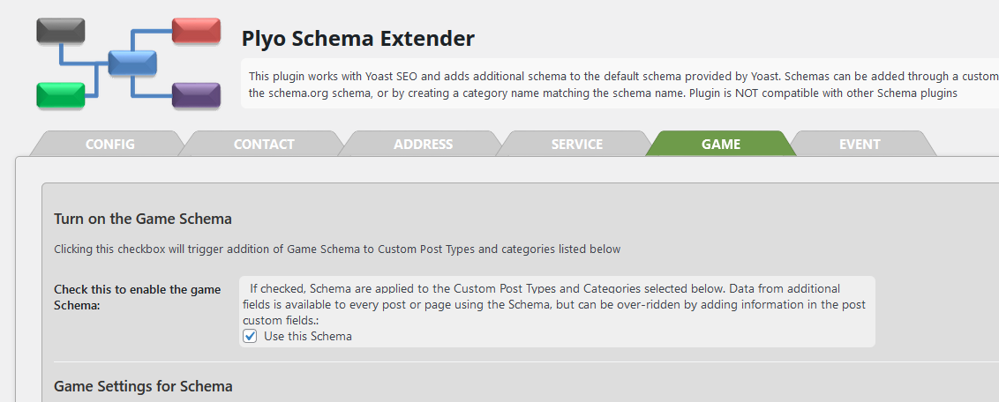


## Installation

Note that **Yoast SEO must be installed** for this plugin to work! PLSE adds its information to the Yoast schema data on your pages and posts, and cannot function without Yoast. 

If Yoast Local Business is installed, you'll see an option to use this data in your schema when the plugin is installed and loaded.

*Admin Installer via search*:

1. Visit the Add New plugin screen and search for "plyo schema extender".
2. Click the "Install Now" button.
3. Activate the plugin.
4. Navigate to the "Plyo Schema Ext" Menu.

*Admin Installer via zip*:

1. Visit the Add New plugin screen and click the "Upload Plugin" button.
2. Click the "Browse..." button and select zip file from your computer.
3. Click "Install Now" button.
4. Once done uploading, activate Plyo Schema Extender in the admin Plugins list.

*Manual*:

1. Upload the Plyo Schema Extender folder to the plugins directory in your WordPress installation.
2. Activate the plugin.
3. Navigate to the "Plyo Schema Ext" Menu.'

Once the plugin is installed, you should see a link in wp-admin under your Yoast Plugin:

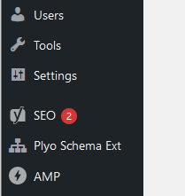

You can configure PLSE using the first tab.

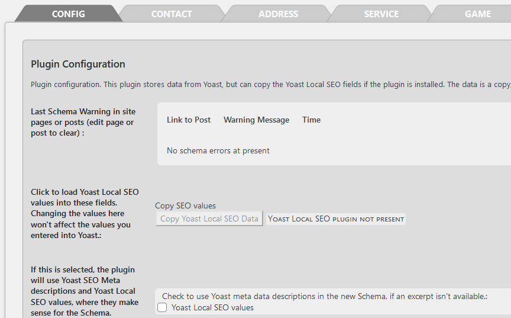

Use the tabs for Game, Service, and Event to assign these schema to your pages and posts. 

In pages and posts that you have set to have schema, you'll see additional meta-boxes where you can type in schema information, as shown in this image:

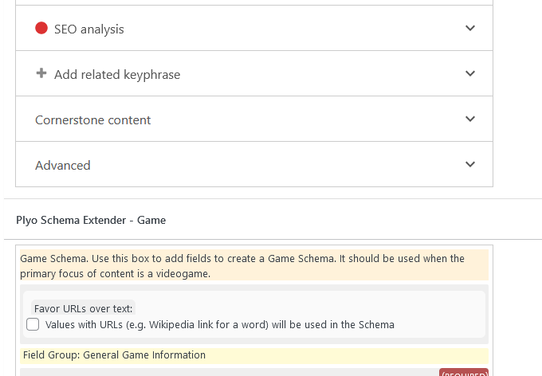


## Basic Information in the Plugin

One of the things missing in the basic version of Yoast SEO is detailed information about your company or organization. Plyo Schema Extender lets you manually add this information in using the Contact tab in the plugin:

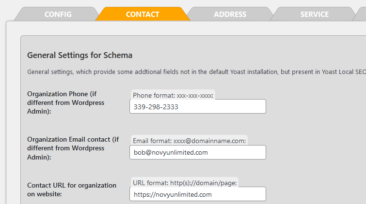


If you have the Yoast Local SEO plugin installed, you can click the button under "config" to copy its values into PLSE. These values are separate from Yoast Local SEO and the original values are unaffected.


## Assigning Additional Schema

Plyo Schema Extender lets you add Game, Event, and Service schema (which Yoast currently does not support). These schema are not simple. Before you enter schema data, you need to study them and  determine the following:

1. Whether the schema(s) make the most sense for your content

2. Specific information required and/or optional for the schema at

   [Schema.org]: https://schema.org	"Schema.org"

 This site has the most comprehensive information. However, search engines like Google only recognize some of this information. For Google, you should check the following URL for guides to specific schema recognized by the search engine.

[Google's]: https://developers.google.com/search/docs/advanced/structured-data/search-gallery	"Structured Data Reference "

Select the schema you want to add using the tabs. At present, the plugin only supports the "Service," "Game,"  and "Event" schema. 

In the image below you can see the configuration of a specific schema. Schema can be assigned to both Pages and Posts. To enable the schema, select the "enable" checkbox.

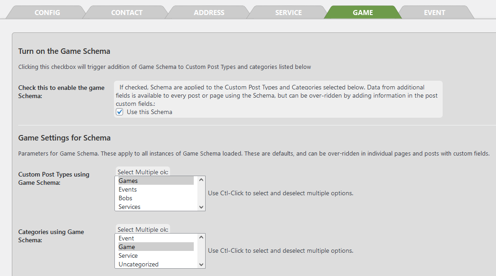

After the schema is enabled, you have two options assigning it to pages and posts. The first, and probably the easiest for a new website is to make a nwq Custom Post Type (CPT), and assign your schema to it. 

[The Webdev Custom Post Type Plugin]: https://webdevstudios.com/	"Custom Post Type Plugin"

is a good way to add CPTs, if you aren't a developer.

In the above screenshot, the Game schema has been assigned to the CPT "Games."  Note that the CPT name does not have to match the schema name, and you can set one schema to multiple CPTs by a shit-click inside the CPT list.

You can also assign schema to specific WordPress categories. This allows you to assign a schema to only those pages or posts with that category. 

1. Define categories for pages, posts, or CPTs
2. Open a page or post. 
3. Check the category and save the page or post

 This is probably the best option if you have a large site with lots of pages and posts. 

If you assign by CPT every post of that CPT type will get schema fields on every single post. To enable local on/off control of schema, you can set an option in the Config tab. Checking this adds a checkbox to each page or post that has the schema assigned.

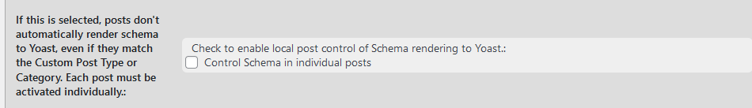

At the start of the schema, you'll see the following checkbox:

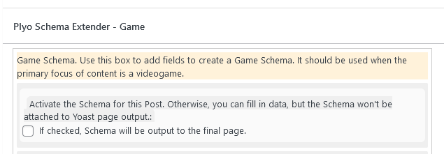

Note that is is not the best option. If you have a lot of CPTs, pages, or posts, and only want to apply schema to some, create new WordPress categories, and assign them to the individual posts.

Note that some schema have default values visible in the plugin tabs. 


You might use these if your website represents a single schema under Service, Game, or Event. All pages and posts linked to the schema by CPTs or categories will get the default values you enter. 


## Entering Schema Data in Pages and Posts

Schema data entry appears as a set of empty meta-boxes in your pages and posts. The meta-boxes will appear under the fields added by Yoast SEO itself.

- To enter your data, just type. Some fields may let you use the WordPress Media Library to select an image, or upload one from your local system.
- Image fields that accept an address (URL) may also create a small thumbnail image, so you can check if it worked. 
- The Video URL fields check either YouTube or Vimeo, and create a mini-player if the URL is correct, along with a thumbnail image.

The plugin flags some meta box fields that are required for each schema with a warning message in the upper-right, as seen here:

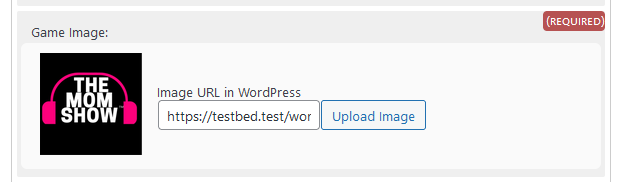

If you don't fill these required fields in, or fill them in incorrectly, your schema data will be written, but PLSE will flag the error (make sure you refresh the page manually):

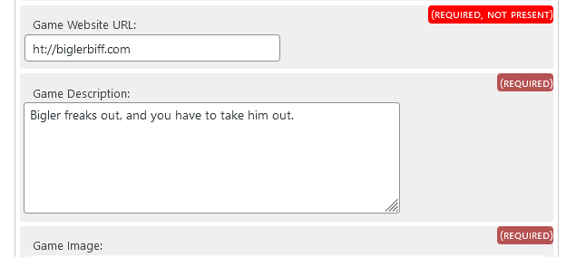


The plugin also keeps links to invalid pages and posts under the Config flag in the plugin.

Adding in the Internet address of a website, image, or other asset is common. PLSE expects these web addresses to be in URL (Uniform Resource Locator) format. If you want PLSE to check if your URLs are valid, select the following option in the plugin Config tab:

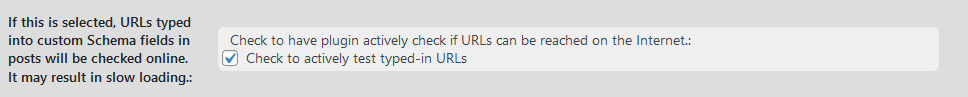

Checking this options causes an additional error message to appear beside the meta-box in each page or post with non-functional URLs:

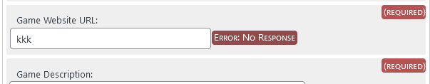

Note that this may slow up your page and post editing, since the plugin tries all the addresses to see if they work. It will not affect user access to your site.

All schema data is appended to the default Yoast SEO schema values. If you do a "view source" on a published page or post you can find this JSON+LD data similar to the following:

```javascript
<script type="application/ld+json" class="yoast-schema-graph">
(=========YOAST schema data=============)
{"@context":"https://schema.org","@graph":[{"@type":"WebSite","@id":"https://testbed.test/wordpress/#website","url":"https://testbed.test/wordpress/","name":"Novy Unlimited Game PR","description":"Just another WordPress site","potentialAction":[{"@type":"SearchAction","target":{"@type":"EntryPoint","urlTemplate":"https://testbed.test/wordpress/?s={search_term_string}"},"query-input":"required name=search_term_string"}],"inLanguage":"en-US"},{"@type":"WebPage","@id":"https://testbed.test/wordpress/game/test-game-cpt/#webpage","url":"https://testbed.test/wordpress/game/test-game-cpt/","name":"Test Game CPT - Novy Unlimited Game PR","
...
...
(===========PLSE schema data================)                {"@context":"https://schema.org","@type":"VideoGame","@id":"https://testbed.test/wordpress/game/test-game-cpt/#webpage","name":"Bigler Freaks Out","url":"http://kkk","image":"https://testbed.test/wordpress/wp-content/uploads/2021/07/the-mom-show.jpg","screenshot":"https://testbed.test/wordpress/wp-content/uploads/2021/07/hmds-scaled.jpg","description":null,"inLanguage":["English"],"installURL":"https://download.com","datePublished":"1970-01-01","contentRating":"ERSB T","audience"
...
...
</script>
<!-- / Yoast SEO plugin. -->
```


## Special Issues

1. The standard 

   [WordPress Plugin]: https://wordpress.org/plugins/amp/	"Wordpress AMP plugin"

    fails when PLSE is installed, unless you explicitly assign Custom Post Types to be processed by AMP. 

2. If you are using the AMP plugin, make sure your AMP settings are set to "Standard" and you enable Advanced Settings -> Content Types -> Your Custom Post Type. Otherwise, you'll wee Web Console errors.

3. Some things that are not supported in Plyo Schema Extender include:

   - offers
   - reviews
   - subjectOf

   These sub-objects are too complex for PLSE. Plyo Schema Extender only supports "repeater" fields for plain text and images.

   

4. The Service Schema is a particular problem in pricing data. Pricing might be bulk, by the hour, or made of of multiply priced sub-services. They are currently not supported by the plugin.
   https://www.schemaapp.com/schema-markup/services-schema-markup-schema-org-services/

   

## Frequently Asked Questions

**Q:** *How do I restrict Schema?*

**A:** In plugin options, you can select posts for each Schema. 

1. You can restrict by Custom Post Type (CPT) 
2. You can create categories for posts and pages which trigger the Schema
   

**Q:** *How can I integrate with Yoast Local SEO?*

**A:** If you have Yoast Local SEO installed, just go to the Config tab of the plugin in WP_Admin, and click the "load Local" SEO button. The plugin will copy Yoast Local SEO values into your configuration, overwriting anything currently there. Changes in the plugin don't affect Yoast at all.


**Q:** *How would I add a new Schema type?*

**A:** This requires custom coding in the plugin, so is not currently possible. 


